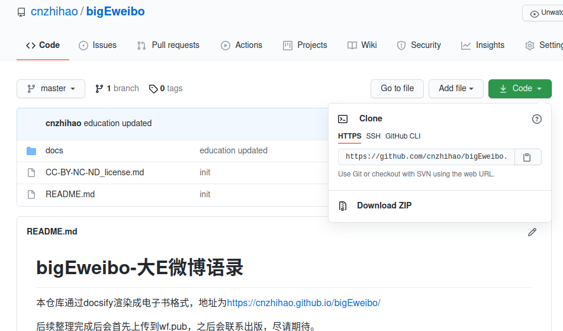

# 主理人git使用手册

各位主理人，本文档用于了解如何维护电子书内容及如何使用git上传电子书至远程仓库。如有问题，可直接在微信群中沟通。感谢大家。


## step1：安装git

linux环境下输入

```
sudo apt-get install git
```

系统会自动安装，安装完成后，输入

```
git --version
```

检查git的版本，如果系统显示了git的版本号，则表明git安装成功了。进入第二步。


## step2：仓库克隆

第二步，克隆仓库，克隆仓库通过http进行仓库克隆，克隆地址通过下图获取：



选择https，复制git链接。进入终端，输入：

```
git clone https://github.com/cnzhihao/bigEweibo.git
```

clone完成后，系统就将远程仓库克隆到了当前的计算机中，可以在计算机的主目录下找到对应仓库的文件夹。

注：如果clone时位于其他文件夹下，则仓库会被克隆到对应的文件夹中。


## step3：进入仓库

在主文件下完成仓库克隆后，通过 cd 命令进入对应文件夹。

```
cd bigEweibo
```

因为我们仓库的名字叫bigEweibo，所以进入bigEweibo文件夹即可进入项目的本地仓库。

### 仓库简介

仓库通过docsify初始化获得，当前的文件夹体系如下：

```html
/docs
--/docs/education
--/docs/marriage
--/docs/work
--/docs/social
```

docs是docsify的文档渲染源，html会将docs文件夹中的markdown文件进行渲染，方便其在网页中展示。


## step4：搬运文章并维护目录

大家克隆完仓库后，可以在系统的主目录下找到仓库所在文件夹。

将编辑整理完成的article.md文章文件放到仓库文件夹下对应的文件夹中。放置位置按以下方式为准。

```html
/docs
--/docs/education  # 教育篇
--/docs/marriage  # 婚姻篇
--/docs/work  # 职场篇
--/docs/social  # 社会篇
```

将文章放置在对应的文件夹中后，需要编写文件夹中的子目录文件`contents-of-xxx.md`中。不同文章类型的子目录文件不同，具体如下：

```
# 教育篇 contents-of-education.md
# 婚姻篇 contents-of-marriage.md
# 职场篇 contents-of-work.md
# 社会篇 contents-of-social.md
```

目录按照docsify的文章链接渲染方式确认。**以教育篇为例，当前的目录格式如下：**

```
# 教育篇

（施工中……）

## 分类1

[教育篇坑位1](/教育篇/article1)

## 分类2

……

## 分类3

……
```

教育篇分类前给了一个文字块（写了施工中的部分），主理人在这个部分把自己所负责篇章的内容简单介绍一下，再写一点自己的心得，保持在200字以内即可。

之后，在分类1、分类2、分类3中，按照当前维护的大篇章子类进行书写，如果有更细的分类只需用更小的标题展示即可。比如教育篇有青少年教育、成年人自我教育两个大类，在青少年教育下有怎么管、学什么、学区房择校升学三个小类，则目录按如下方式维护：

```
# 教育篇

小匠的一点心得

## 青少年教育

### 怎么管

### 学什么

### 学区房、择校、升学

## 成年人自我教育
```

目录维护完成后，按照excel表格中的article编码，根据分类进行梳理，填写到目录中。文章超链接的填写格式如下：

```
[文章标题](/篇章类型/article编码)
```

例如教育篇第一篇文章归因与惩罚，则超链接的填写格式如下：

```
[归因与惩罚](/education/article1)
```

归因与惩罚隶属于 青少年教育-怎么管 ，则将该超链接填写至 青少年教育-怎么管 下，如下所示：

```
# 教育篇

小匠的一点心得

## 青少年教育

### 怎么管

[归因与惩罚](/education/article1)

### 学什么

### 学区房、择校、升学

## 成年人自我教育
```

这样就完成了一篇文章的链接确认。

**一般情况下，我们把所有的文章搬运进去，再根据excel表格中的信息批量修改目录即可。**


## step5：使用docsify进行本地渲染检查

文章搬运完成之后，本地可以直接在文件夹中进行渲染检查。

打开终端，进入仓库，进入仓库下的渲染文件夹docs。

```
cd bigEweibo/docs
```

然后，启动docsify的服务。

```
docsify serve docs
```

终端会提示服务器已启动，系统开始轮询，进入本地网页查看。

```
Serving /home/cnzh2020/bigEweibo/docs now.
Listening at http://localhost:3000
```

打开浏览器，进入<http://localhost:3000>

进入后，在本地查看电子书渲染结果是否符合预期。若符合预期，则可以将文件上传至远程仓库；若不符合预期，则进行检查修复。


## step6：仓库上传

我们了解的git的玩法构造后(学习链接：<https://www.runoob.com/git/git-basic-operations.html>)，需要将搬运好的文章和目录上传到仓库中。

### 将远程仓库整个拉回本地

首先需要将远程仓库拉回本地。打开终端进行操作。

```
cd bigEweibo  --进入bigEweibo文件夹
git pull origin master  --拉回远程仓库的master分支，更新本地仓库
```

### 检查当前工作区与仓库不同的地方

确认当前工作区与仓库不同的地方，确保不同的地方仅为自己本次上传的范围，防止推送的时候发生覆盖的情况。

```
git status --文件层面检查
git diff --命令行层面检查
```

### 将工作区的内容上传至本地仓库

为防止推送覆盖，大家在上传本地仓库时，仅上传自己维护的文件夹，不要使用全部推送命令。

例如，我是职场篇的负责人，则仅推送职场篇的文件夹，那么需要执行的命令如下：

```
git add docs/education  --即将docs文件夹下属education文件夹下的内容放置到待推送区
git commit -m "本次上传的备注" --将待推送区的内容推送到本地仓库，-m 后双引号里面的备注会在推送远程仓库后显示在远程仓库里，支持中文
```

### 将本地仓库的内容推送至远程仓库

因为我们使用http方法执行仓库同步，因此每次向远程仓库推送数据时需要输入github的账号和密码。

执行远程仓库推送时，主理人需要有推送权限，请联系主负责人智昊获取贡献者权限，成为贡献者后，即可直接向仓库推送数据。

执行git push推送数据至远程仓库。

```
git push origin master --将本地仓库推送到远程仓库origin的master分支
 -- 输入账号
 -- 输入密码，密码输入时，终端不会展示输入的位数，防止偷窥，所以没有看到有密码展示也不用管，继续输入即可。
```

推送成功，大功告成。


## step7：进入网页端查看渲染效果

进入官网：https://cnzhihao.github.io/bigEweibo/#/

